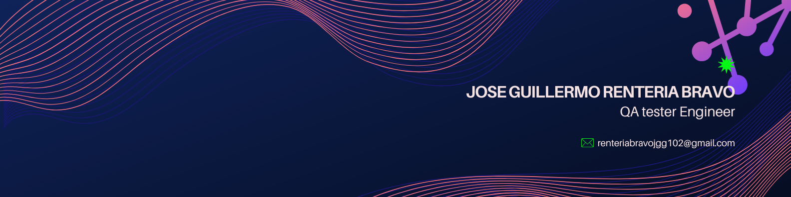

  

👨‍💻 About me :
Quality Assurance Tester focused on ensuring software excellence. Experienced in the execution of manual testing, performance testing, and automation testing (among other testing types) to maximize product coverage and efficiency. Skilled in the creation of detailed test cases, along with bug documentation, reporting, and tracking, guaranteeing effective communication and the full follow-up of defects. I am committed to applying my knowledge to drive quality and reliability throughout every development cycle.

🔭 As a dedicated QA professional, I am focused on mastering Test Automation to drive scalable efficiency. I am concurrently undertaking in-depth studies in application and web development. My goal is to evolve into a skilled Automation Tester, leveraging deep code knowledge for robust and high-quality solution implementation.

🌱 Tools such as: Selenium, SQL language (DBeaver), Python using the Pythest and Request libraries, JavaScript for Peformance testing as well as Manual Testing tools, such as Jira, Azure devops, Postman, Android Studio, Proxyman, Visual Studio Code and GrafanaK6.

📫 Would you like to contact me? 

📧 renteriabravojgg102@gmail.com

📱 +52 664-11-41-869

🌐 Language: Native Spanish and Conversational English.

### :hammer_and_wrench: Language and tools :

  
   

